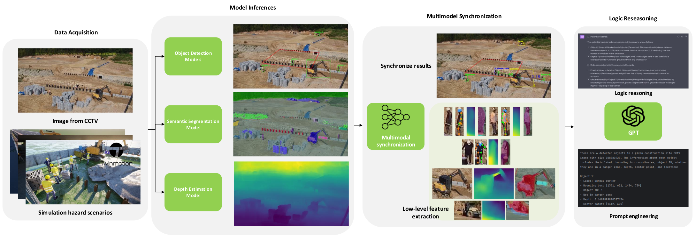
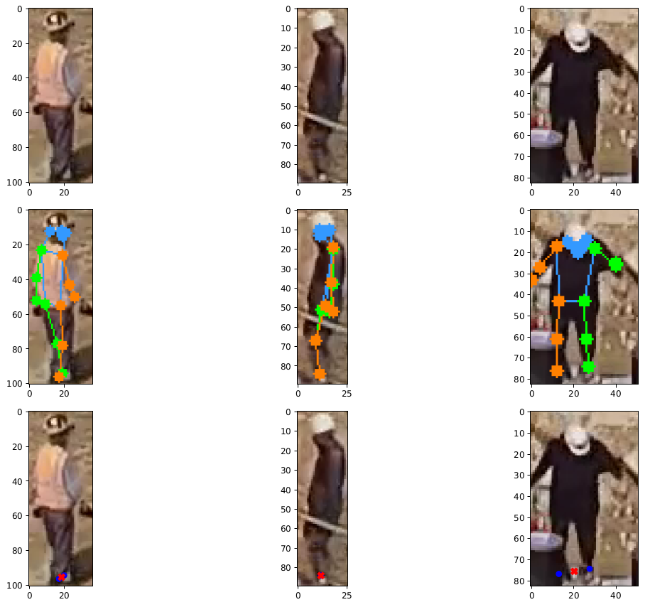
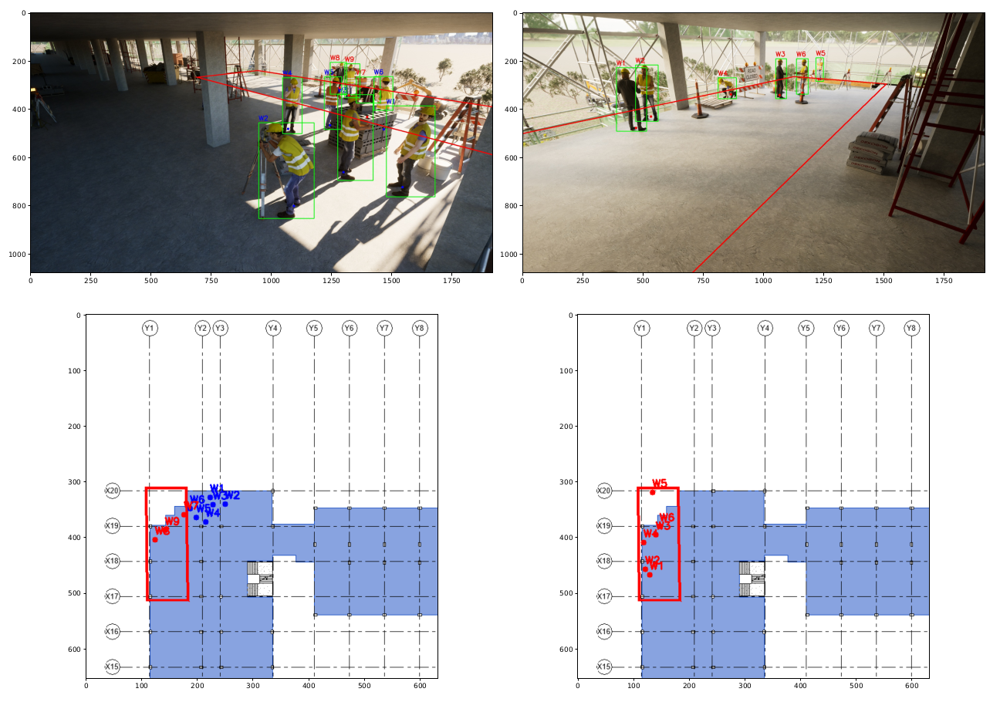
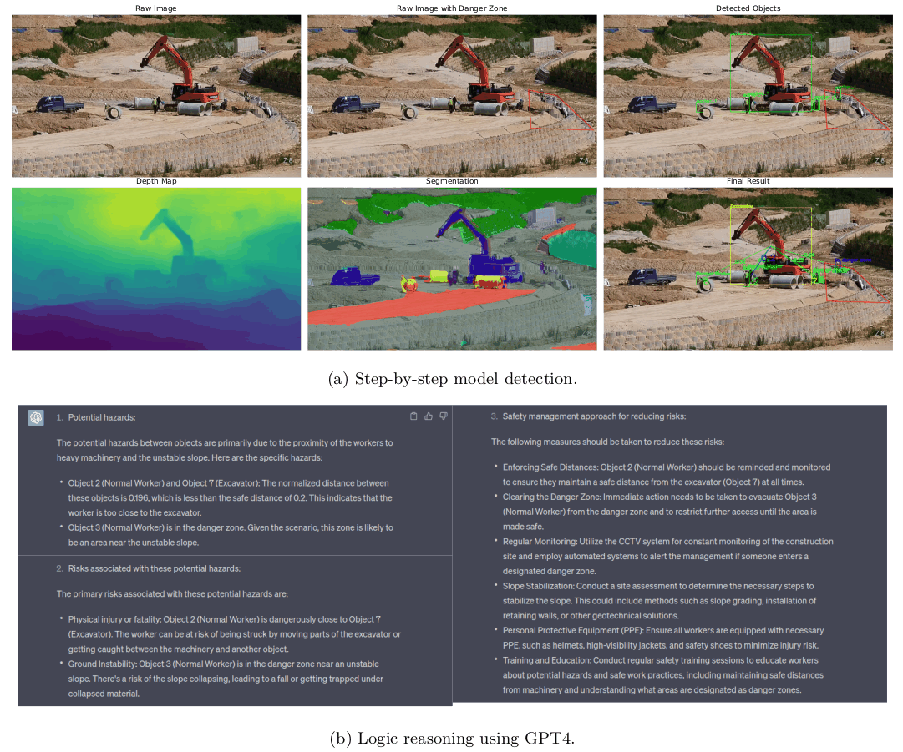

# Image-to-Hazard: GPT-based Logic Reasoning for Hazard Identification in Construction Site using CCTV Data
This paper is accepted by the **41st  International Symposium on Automation and Robotics in Construction (ISARC)**, Lille, France, June 3 - 7 , 2024. 
Link to access [paper](https://doi.org/10.22260/ISARC2024/0039).
## Proposed approach

## Demo 

## Sample results
#### Pose estimation

#### Convert image coordinate to global coordinate

#### Hazard identification with GPT-based models

## Acknowledgement
This work is inspired by [Image2Paragraph](https://github.com/showlab/Image2Paragraph), [GPT API](https://platform.openai.com/), [OpenMMLab](https://platform.openmmlab.com/home/).
